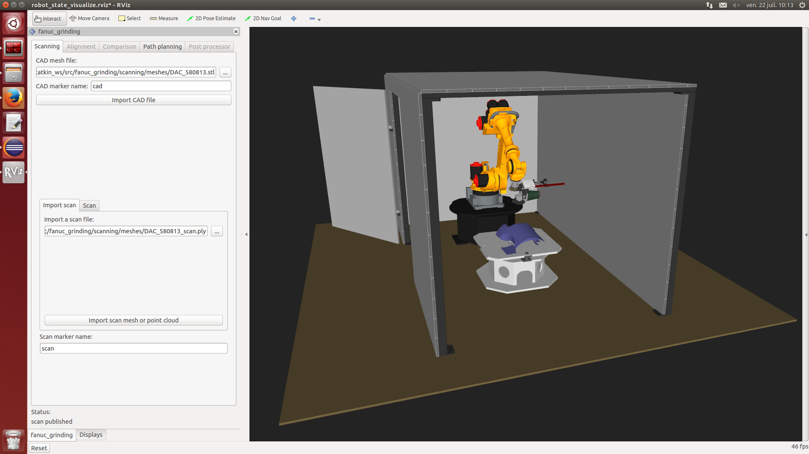

[](http://www.institutmaupertuis.fr)

# :warning: **This project is not maintained!**

This is a ROS package of a Fanuc R1000iA 80f with a grinding end effector and a 3D sensor mounted on the end effector.
This package aims to allow to automatically grind mechanical defects of parts given their CAD model.



[](https://www.youtube.com/watch?v=aLp8zxx1PnU)
Click the image for a video

The [documentation](documentation/README.md) folder contains explanations about how this package works.

# Directories in the project

| Directory  | Description
------------ | -----------
`alignment` | Description/implementation of the alignment service
`comparison` | Description/implementation of the comparison service
`documentation` | Contains explication about this package usage
`fanuc_grinding` | Contains the meta-package files
`path_planning` | Description/implementation of the path planning service. This makes use of the `bezier` package
`post_processor` | Description/implementation of the post processor service to create a Fanuc TP program. This makes use of the `fanuc_post_processor` package
`publish_meshfile` | Description/implementation of a service that publishes meshes/point clouds on markers
`rviz_plugin` | Contains the definition and implementation of the grinding RViz plugin
`scanning`| Description/implementation of the scanning service, the RViz plugin also allows to load a mesh/point cloud.

# Dependencies
- [Robot Operating System](http://wiki.ros.org/ROS/Installation)
- [`industrial-core`](http://wiki.ros.org/industrial_core)
- [`fanuc`](http://wiki.ros.org/fanuc)
- [`fanuc experimental`](http://wiki.ros.org/fanuc_experimental)
- [`institut_maupertuis_robots_descriptions`](https://github.com/InstitutMaupertuis/institut_maupertuis_robots_descriptions)
- [`bezier`](https://github.com/ros-industrial-consortium/bezier)
- [`fanuc_post_processor`](https://github.com/InstitutMaupertuis/fanuc_post_processor)

This package has been tested with Ubuntu 16.04 and ROS Kinetic.
The package was designed to be used with a Fanuc R1000iA-80f robot, however it should be easy to port it on other ROS compatible robots.

# Install
Install the dependencies by cloning the repositories into your catkin workspace.

`cd` to your catkin workspace source directory:
```
git clone https://github.com/InstitutMaupertuis/fanuc_grinding.git &&\
cd .. &&\
catkin build
```

# Usage
Simulation:
```
roslaunch fanuc_grinding_rviz_plugin r1000ia_sls_2.launch
```

Load a scan from the drive to skip the scanning part.

Real hardware:
```
roslaunch fanuc_grinding_rviz_plugin r1000ia_sls_2.launch \
sim:=false \
robot_ip:=192.168.100.200
```

Make sure to test the David SLS-2 configuration before testing with this application.

# Documentaton
It is [here](documentation).
